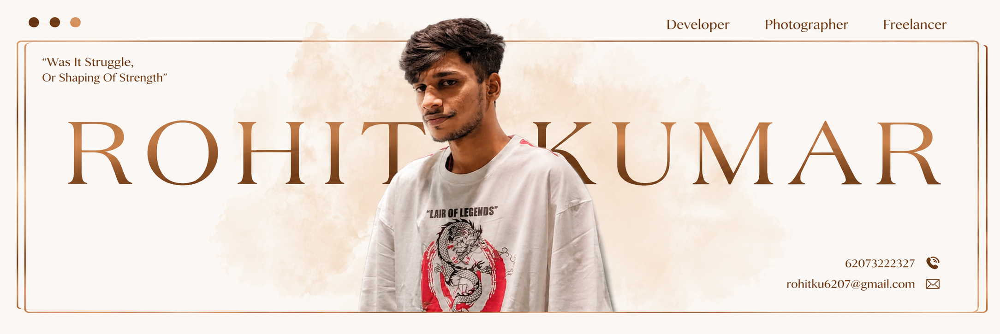
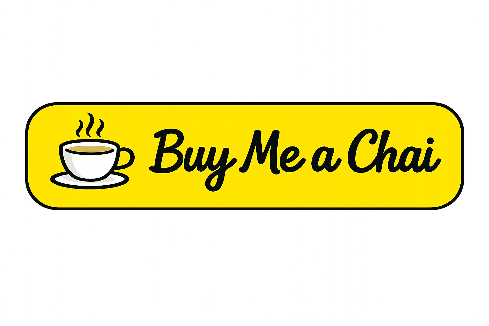

<h1 align="center">
  
</h1>

  

<table align="center" width="100%" style="border-collapse:separate;border-spacing:20px;">
<tr>

<td width="50%" valign="top"
style="padding:25px;border:1px solid #30363d;border-radius:12px;">

<h2 align="center">👨‍💻 About Me</h2>

I'm <b>Rohit Kumar</b>, a <b>B.Voc Software Development Graduate</b> from <b>MCKV Institute of Engineering</b>.

I worked as a <b>Software Development Intern at Trideon Tech</b>, where I contributed to real-world software projects while gaining practical experience in full-stack development, teamwork, and industry-standard development workflows.

I enjoy building <b>AI-powered web applications</b>, scalable full-stack software, and modern user experiences.

I love learning new technologies, participating in hackathons, and continuously improving my development skills by building practical projects.

</td>

<td width="50%" valign="top"
style="padding:25px;border:1px solid #30363d;border-radius:12px;">

<h2 align="center">🏆 Achievements</h2>

- 🏆 <b>Google Cloud Champion</b> – Achieved <b>Champion Tier</b> in the <b>Google Cloud Arcade Program</b>.

- 🥈 <b>First Runner-up</b> – <b>Smart India Hackathon (SIH)</b> for developing an innovative software solution.

- 🎓 <b>Academic Topper</b> – Graduated <b>B.Voc Software Development (2026)</b> with an overall <b>9.4 CGPA</b>.

- 🎯 <b>Organizer</b> – <b>Pragati 2025</b>, the Annual Technical Fest of <b>MCKV Institute of Engineering</b>.

- 🤖 <b>Organizer</b> – Conducted a <b>2-Day Generative AI Workshop</b> for <b>1st & 2nd Year Students</b> at MCKV Institute of Engineering.

- ⚡ <b>Contest Enthusiast</b> – Actively participated in coding and technical contests such as <b>CodeEals</b>, <b>Spectrum</b>, and <b>Quizomania</b>, securing finalist positions and awards.

</td>

</tr>
</table>

---

<h2 align="center">💻 Tech Stack & Tools</h2>

 

  
  
  
  
  
  
  
  
  
  
  
  
  
  
  
  
  
  
  
  
  
  
  
  
  
  
  

 

  
  
  
  
  
  

 

  
  

  
  

  
  

  
  

  
  

  
  

  
  

  

---

<h2 align="center">📊 GitHub at a Glance</h2>

  

<table align="center" width="100%">
<tr>
<td width="50%" align="center">

</td>

<td width="50%" align="center">

</td>
</tr>
</table>

---
<table align="center" width="100%" style="border-collapse:collapse;">
<tr>

<td width="60%" valign="middle"
style="padding:25px;border:1px solid #30363d;border-radius:12px;">

<h2 align="center">🚀 Beyond the Code</h2>

  I build scalable web applications, explore AI-powered solutions, 
  and enjoy transforming ideas into real-world products.

🧩 Problem solver by habit, designer by instinct.

<h3 align="center">🌐 Let’s Connect</h3>

  
  &nbsp;&nbsp;

  
  &nbsp;&nbsp;

  
  &nbsp;&nbsp;

  

</td>

<td width="40%" align="center" valign="middle"
style="padding:25px;border:1px solid #30363d;border-radius:12px;">

</td>
</tr>
</table>

  

  

